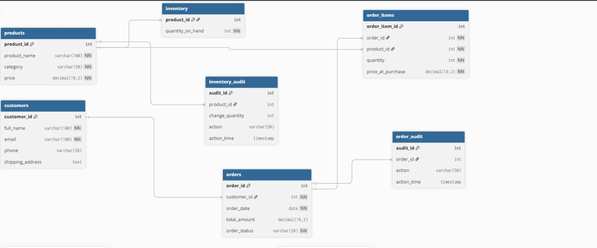

# Inventory and Order Management System

##  Overview

This project implements a relational database system for managing customers, products, inventory, and orders. It supports multi-product orders, inventory tracking, and audit logging.

---

##  Features

* Multi-product order processing
* Inventory management with real-time updates
* Order lifecycle tracking (Pending → Completed)
* Audit logging:

  * Order audit trail
  * Inventory audit trail
* Data integrity with constraints and foreign keys
* Performance optimization with indexes

---

## Database Schema

* Customers
* Products
* Inventory
* Orders
* Order Items
* Order Audit
* Inventory Audit

---

##  Core Functionality

### ProcessNewOrder()

* Validates customer
* Processes multiple products per order
* Updates inventory
* Logs all actions
* Handles errors (e.g., insufficient stock)

---

##  ER Diagram



---

##  Setup Instructions

### 1. Create Database

```sql
CREATE DATABASE inventory_db;
```

### 2. Run Schema

```bash
psql -U postgres -d inventory_db -f sql/schema.sql
```

### 3. Load Data & Logic

```bash
psql -U postgres -d inventory_db -f sql/data_and_logic.sql
```

---

##  Example Usage

```sql
SELECT ProcessNewOrder(
  2,
  '[{"product_id":3,"quantity":1},{"product_id":4,"quantity":2}]'
);
```

---

##  Author

Damas Niyonkuru

---

